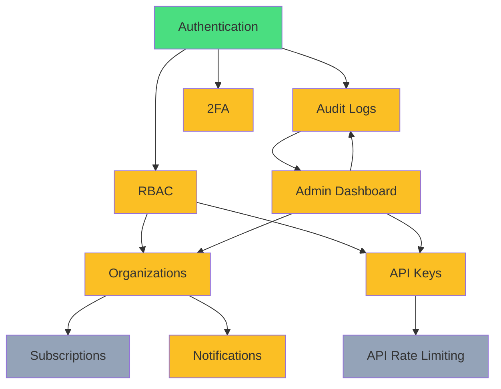

# 🔄 Next.js SaaS Kit - Implementation Workflow

> **Generated**: 2025-10-04
> **Status**: Phase 2 (Security & Enterprise) - In Progress (Uncommitted)
> **Target**: Production-ready SaaS platform with enterprise features

---

## 📊 Executive Summary

This Next.js 15 SaaS starter kit has completed **Phase 1 (Foundation)** and recently added **Phase 2 (Security & Enterprise)** features that are **uncommitted and require formalization, testing, and production-ready integration**.

### Current State
- ✅ **Phase 1 Complete**: Authentication, Database, UI, Subscriptions, AI Chat
- 🚧 **Phase 2 Implemented**: 2FA, Organizations, API Keys, RBAC, Audit Logs, Admin Dashboard
- ⚠️ **Phase 2 Status**: Backend complete, Frontend partial, Testing 0%, Documentation minimal

### Critical Gaps
1. **Security**: 2FA lacks rate limiting, incomplete RBAC enforcement
2. **Frontend**: Missing UI for Organizations and API Keys management
3. **Testing**: Zero automated test coverage
4. **Documentation**: API docs missing, user guides incomplete

### Timeline to Production
- **Single Developer**: 6 weeks (208 hours)
- **Team of 2**: 3 weeks (104 hours each)
- **Critical Path**: RBAC → Frontend → Testing → Security Audit

---

## 🏗️ Technology Stack

### Core Technologies
- **Framework**: Next.js 15.3.1 (App Router, Turbopack)
- **Runtime**: React 19, Node.js 20+
- **Language**: TypeScript 5 (strict mode)
- **Database**: Neon PostgreSQL + Drizzle ORM 0.43.1
- **Authentication**: Better Auth 1.2.8 (Google OAuth, Email/Password, 2FA)
- **Payments**: Polar.sh (subscription management)
- **Storage**: Cloudflare R2 (S3-compatible)
- **AI**: OpenAI SDK (chatbot)
- **Analytics**: PostHog

### UI/UX Stack
- **Styling**: Tailwind CSS v4 (utility-first)
- **Components**: shadcn/ui + Radix UI primitives
- **Icons**: Lucide React, Tabler Icons
- **Forms**: React Hook Form + Zod validation
- **Notifications**: Sonner (toast notifications)
- **Themes**: next-themes (dark/light mode)

### Security & Infrastructure
- **2FA**: Speakeasy (TOTP) + QRCode generation
- **Hashing**: crypto (SHA-256 for API keys)
- **Email**: Resend (transactional emails)
- **Deployment**: Vercel (recommended)

---

## 🎯 Implementation Phases

### Phase 1: Foundation ✅ COMPLETE
**Status**: Production-ready
**Duration**: Completed
**Features**:
- Next.js 15 App Router setup with Turbopack
- Neon PostgreSQL + Drizzle ORM integration
- Better Auth with Google OAuth
- Email/password authentication
- User profile management
- Subscription management (Polar.sh webhooks)
- shadcn/ui component library
- OpenAI chatbot integration
- Cloudflare R2 file upload system
- PostHog analytics integration
- Dark/light theme support

**Database Schema (Phase 1)**:
- `user`, `session`, `account`, `verification` (Better Auth)
- `subscription` (Polar.sh integration)

---

### Phase 2: Security & Enterprise 🚧 IN PROGRESS
**Status**: Backend complete, Frontend partial, Testing needed
**Duration**: Week 1-6 (6 weeks total)
**Git Status**: **UNCOMMITTED** - Requires formalization

#### 2.1 Two-Factor Authentication (2FA)

**Status**: ✅ Backend Complete | ✅ Frontend Complete | ❌ Testing Needed

**Features**:
- TOTP-based authentication (Google Authenticator, Authy)
- QR code generation for easy setup
- Backup codes (10 single-use codes)
- Enable/disable 2FA flow
- Backup code regeneration

**Components**:
```
lib/2fa.ts                              - Core 2FA logic
app/api/2fa/setup/route.ts              - Initiate 2FA setup
app/api/2fa/verify/route.ts             - Verify TOTP code
app/api/2fa/disable/route.ts            - Disable 2FA
app/api/2fa/status/route.ts             - Check 2FA status
app/dashboard/settings/security/page.tsx - User interface
```

**Database**:
```sql
twoFactorAuth (id, userId, secret, backupCodes, isEnabled, createdAt, updatedAt)
```

**Dependencies**:
- `speakeasy` - TOTP library (RFC 6238)
- `qrcode` - QR code generation
- User authentication session
- Database: `twoFactorAuth` table

**Testing Requirements**:
- ✅ Unit: Secret generation, code validation, backup code management
- ❌ Integration: Setup flow, verification flow, disable flow
- ❌ E2E: Complete 2FA enrollment, login with 2FA, backup code usage
- ❌ Security: Timing attacks, brute force protection, secret storage validation

**Security Gaps** 🔴:
- ⚠️ **Rate limiting missing** on verification endpoint → Brute force vulnerability
- ⚠️ **Account lockout missing** after failed attempts → Security risk
- ⚠️ **Audit logging partial** - Some 2FA events not logged

**Action Items**:
- [ ] Add rate limiting (5 attempts per 15 minutes)
- [ ] Implement account lockout (3 failures = 15 min lockout)
- [ ] Complete audit log integration for all 2FA events
- [ ] Add 2FA requirement enforcement option (admin setting)
- [ ] Write unit tests (15 test cases)
- [ ] Write E2E tests (3 scenarios: setup, login, backup code)

---

#### 2.2 Organization Management

**Status**: ✅ Backend Complete | ❌ Frontend Incomplete | ❌ Testing Needed

**Features**:
- Organization creation with unique slug
- Team member management (invite, remove, role changes)
- Email invitation system with 7-day expiration
- Member roles: Owner, Admin, Member
- Organization-level subscriptions (partial)

**Components**:
```
lib/organizations.ts                            - CRUD operations
app/api/organizations/route.ts                  - Create/list organizations
app/api/organizations/[id]/route.ts             - Update/delete org
app/api/organizations/[id]/invite/route.ts      - Member invitations
app/dashboard/settings/organization/page.tsx    - Management UI (BASIC)
```

**Database**:
```sql
organization (id, name, slug, description, logo, website, isActive, createdAt, updatedAt)
organizationMember (id, organizationId, userId, role, isActive, joinedAt, updatedAt)
organizationInvite (id, organizationId, email, role, invitedBy, token, expiresAt, isAccepted, acceptedAt, createdAt)
```

**Dependencies**:
- Email notifications (`lib/notifications/email.ts`)
- RBAC system (`lib/rbac.ts`)
- Subscription management (organization-level billing)

**Testing Requirements**:
- ❌ Unit: Org creation, member operations, invite flow
- ❌ Integration: Multi-user org workflows, role transitions
- ❌ E2E: Create org → invite members → role management → delete org
- ❌ Security: Permission checks, invite token validation, slug uniqueness

**Implementation Gaps** 🟡:
- ✅ Cascade deletes configured (database integrity)
- ✅ Role-based access control integrated
- ⚠️ Invite expiration handling (basic implementation)
- ⚠️ Subscription-org linkage (partial - needs completion)
- ❌ **Frontend UI incomplete** - Basic structure only
- ❌ **Email templates not production-ready** - Welcome email only

**Action Items**:
- [ ] Build organization management dashboard (list, create, switch)
- [ ] Create member invitation flow UI (send, view pending, resend)
- [ ] Add role management interface (view members, change roles)
- [ ] Implement organization settings page (name, slug, logo, website)
- [ ] Add organization switcher component (multi-org support)
- [ ] Complete subscription-organization linkage logic
- [ ] Design and implement invitation email template
- [ ] Write integration tests (15 test scenarios)
- [ ] Write E2E tests (3 workflows)

---

#### 2.3 API Keys Management

**Status**: ✅ Backend Complete | ❌ Frontend Missing | ❌ Testing Needed

**Features**:
- API key generation with `sk_` prefix
- SHA-256 hashing for secure storage
- Key rotation (invalidate old, generate new)
- Permission-based scoping (JSON array)
- Expiration support with automatic validation
- Last used timestamp tracking
- User-level and organization-level keys

**Components**:
```
lib/api-keys.ts                                 - Key generation, validation
lib/api-auth.ts                                 - API authentication middleware
app/api/dev/api-keys/route.ts                   - Create/list keys
app/api/dev/api-keys/[id]/route.ts              - Update/delete key
app/api/dev/api-keys/[id]/rotate/route.ts       - Key rotation
```

**Database**:
```sql
apiKey (id, name, hashedKey, userId, organizationId, permissions, lastUsedAt, expiresAt, isActive, createdAt, updatedAt)
```

**Dependencies**:
- RBAC system (permission validation)
- Audit logs (key creation, usage, rotation tracking)
- User/Organization context

**Testing Requirements**:
- ❌ Unit: Key generation, hashing, validation, rotation
- ❌ Integration: Permission checks, expiration handling, last used tracking
- ❌ E2E: Create key → use in API request → rotate → validate new key
- ❌ Security: Hash strength, key exposure prevention, rate limiting

**Implementation Gaps** 🔴:
- ✅ SHA-256 hashing implemented
- ✅ Permission-based scoping (JSON array)
- ✅ Expiration support
- ⚠️ Last used timestamp tracking (basic implementation)
- ❌ **Rate limiting per API key** (missing - security risk)
- ❌ **Frontend UI missing** (no user-facing management)
- ❌ **API documentation missing** (no developer guide)
- ❌ **Key usage analytics missing** (no insights for users)

**Action Items**:
- [ ] Build API key management page (list, create, view, delete)
- [ ] Add key creation form with permission selection
- [ ] Implement key rotation UI with confirmation
- [ ] Show key usage statistics (last used, request count)
- [ ] Add API documentation viewer (endpoints, authentication)
- [ ] Create API key testing playground (live API testing)
- [ ] Implement rate limiting per API key (configurable limits)
- [ ] Generate API documentation (OpenAPI/Swagger)
- [ ] Write unit tests (20 test cases)
- [ ] Write integration tests (10 scenarios)

---

#### 2.4 Role-Based Access Control (RBAC)

**Status**: ✅ Core Complete | ⚠️ Integration Partial | ❌ Testing Needed

**Features**:
- Granular permission system (resource:action pattern)
- User roles: `user`, `admin`, `super_admin`
- Organization roles: `member`, `admin`, `owner`
- Permission helper functions
- Role hierarchy enforcement

**Components**:
```
lib/rbac.ts                 - Permission definitions, role checking
Integration: All API routes, UI components (PARTIAL)
```

**Permission Matrix**:

| User Role | Permissions |
|-----------|-------------|
| `user` | Own resources only (read:own, update:own) |
| `admin` | All users, orgs, subscriptions (read:all, update:all) |
| `super_admin` | Full system access (*:*) |

| Organization Role | Permissions |
|-------------------|-------------|
| `member` | Read-only organization access |
| `admin` | Manage members, invites, update org |
| `owner` | Full organization control, subscriptions |

**Dependencies**:
- User authentication (session)
- Organization membership data
- All protected routes (API + pages)

**Testing Requirements**:
- ❌ Unit: Permission checking logic, role hierarchies
- ❌ Integration: Route protection, UI element visibility
- ❌ E2E: User journey per role, permission escalation prevention
- ❌ Security: Authorization bypass attempts, role elevation

**Implementation Gaps** 🔴:
- ✅ Granular permission system designed
- ✅ Helper functions implemented
- ⚠️ **Middleware integration partial** (~60% of routes protected)
- ❌ **Route-level enforcement inconsistent** (security risk)
- ❌ **UI conditional rendering incomplete** (users see forbidden features)
- ❌ **Admin audit trail basic** (permission changes not fully logged)

**Action Items**:
- [ ] Create authentication middleware for route protection
- [ ] Audit ALL API routes for permission checks (100% coverage)
- [ ] Add UI conditional rendering based on permissions (hide/disable)
- [ ] Implement permission denied error pages (403, 404)
- [ ] Add permission change audit logging
- [ ] Write permission integration tests (30 scenarios)
- [ ] Document permission matrix (developer guide)
- [ ] Create permission testing utilities (test helpers)

---

#### 2.5 Audit Logging

**Status**: ✅ Infrastructure Complete | ⚠️ Integration Partial | ❌ UI Missing

**Features**:
- Comprehensive action taxonomy
- IP address and User-Agent tracking
- JSON details field for flexible data
- Non-blocking logging (try-catch)
- Time-series data for analysis

**Components**:
```
lib/audit.ts                - Logging functions, action constants
app/api/*/                  - Integration scattered across routes (~60%)
```

**Database**:
```sql
auditLog (id, userId, organizationId, action, resource, resourceId, details, ipAddress, userAgent, createdAt)
```

**Action Coverage**:
```yaml
Authentication: ✅ login, logout, password_change
User Management: ⚠️ create, update, delete, activate (partial)
Organizations: ⚠️ create, update, invite, member_add (partial)
Subscriptions: ✅ create, update, cancel, payment
API Keys: ❌ create, update, delete, rotate, use (missing)
Security: ⚠️ 2fa_enable, 2fa_disable, security_alert (partial)
```

**Dependencies**:
- User context (session)
- IP address extraction (request headers)
- User agent parsing (`ua-parser-js`)

**Testing Requirements**:
- ❌ Unit: Log entry creation, data validation
- ❌ Integration: Automatic logging in workflows (verify coverage)
- ❌ E2E: Complete audit trail verification
- ❌ Performance: Log storage growth, query optimization

**Implementation Gaps** 🟡:
- ✅ Comprehensive action taxonomy defined
- ✅ Non-blocking logging (async try-catch)
- ⚠️ **Integration coverage ~60%** (40% of actions not logged)
- ❌ **Log retention policy undefined** (storage growth risk)
- ❌ **Admin log viewer UI basic** (search/filter limited)
- ❌ **Log export functionality missing** (compliance requirement)
- ❌ **Real-time alerting missing** (suspicious activity detection)

**Action Items**:
- [ ] Complete integration in ALL API routes (60% → 100% coverage)
- [ ] Build admin log viewer UI component (search, filter, pagination)
- [ ] Implement log export functionality (CSV, JSON)
- [ ] Define log retention policy (90 days recommended)
- [ ] Add log search and filtering (by user, action, date range)
- [ ] Implement real-time alerting (failed logins, permission changes)
- [ ] Add log statistics dashboard (activity heatmap)
- [ ] Write integration tests (audit trail verification)

---

#### 2.6 Notification System

**Status**: ⚠️ Email Infrastructure Basic | ❌ Extensibility Needed

**Features**:
- Resend email integration
- Welcome email template (HTML + text)
- Test notification endpoint

**Components**:
```
lib/notifications/email.ts              - Resend integration
app/api/notifications/test/route.ts     - Test endpoint
```

**Email Templates**:
- ✅ Welcome email (basic)
- ❌ Organization invite (missing)
- ❌ Password reset (missing)
- ❌ 2FA setup confirmation (missing)
- ❌ Subscription notifications (missing)
- ❌ Security alerts (missing)

**Dependencies**:
- Resend API key (env variable)
- Email templates (HTML/Text)
- User preferences (future feature)

**Testing Requirements**:
- ❌ Unit: Email composition, template rendering
- ❌ Integration: Triggered notifications, error handling
- ❌ E2E: Email delivery verification (test inbox)
- ❌ Reliability: Queue resilience, retry logic

**Implementation Gaps** 🟡:
- ✅ Resend integration working
- ⚠️ **Template variety** (1/10 needed)
- ❌ **User notification preferences** (no opt-out/opt-in)
- ❌ **Email queue/retry** (failed sends lost)
- ❌ **Notification center UI** (in-app notifications)
- ❌ **In-app notifications** (real-time alerts)
- ❌ **Email delivery tracking** (open rates, click rates)

**Action Items**:
- [ ] Design email template system (10 templates: invite, reset, 2FA, etc.)
- [ ] Implement email queue with retry logic (3 attempts, exponential backoff)
- [ ] Add user notification preferences (email, in-app, SMS future)
- [ ] Build notification center UI (inbox, mark as read)
- [ ] Add in-app notification system (toast, banner, modal)
- [ ] Implement email delivery tracking (webhooks)
- [ ] Test email delivery reliability (send 100, verify 100)
- [ ] Write email template tests (snapshot testing)

---

#### 2.7 Admin Dashboard

**Status**: ⚠️ Basic Structure | ❌ Limited Functionality

**Features**:
- Admin overview page
- User management (list, view, edit)
- Admin-only route group `(admin)`
- Basic permission enforcement

**Components**:
```
app/(admin)/dashboard/page.tsx          - Overview (BASIC)
app/(admin)/dashboard/users/page.tsx    - User management (BASIC)
app/(admin)/dashboard/layout.tsx        - Admin layout
```

**Current Functionality**:
- ✅ Route structure with admin group
- ✅ Basic user list view
- ⚠️ Permission enforcement (partial)
- ❌ Comprehensive user management (missing)
- ❌ Analytics/metrics (missing)
- ❌ Audit log viewer (missing)
- ❌ System settings (missing)

**Dependencies**:
- RBAC (admin/super_admin only)
- Audit logs (display)
- User management functions
- Organization management
- Subscription data

**Testing Requirements**:
- ❌ Unit: Data fetching, permission checks
- ❌ Integration: Admin actions, bulk operations
- ❌ E2E: Admin workflows, user management
- ❌ Security: Unauthorized access prevention

**Implementation Gaps** 🟡:
- ✅ Basic route structure created
- ⚠️ **Permission enforcement partial** (some routes unprotected)
- ❌ **Comprehensive user management basic** (no bulk operations)
- ❌ **Analytics/metrics missing** (no insights dashboard)
- ❌ **Audit log viewer missing** (can't review activity)
- ❌ **System settings missing** (no configuration UI)
- ❌ **Organization management missing** (no org admin tools)
- ❌ **API key management missing** (no key oversight)

**Action Items**:
- [ ] Expand user management (search, filter, bulk activate/deactivate)
- [ ] Add analytics dashboard (user growth, active users, revenue)
- [ ] Build audit log viewer (search, filter, export)
- [ ] Create system settings page (2FA enforcement, rate limits)
- [ ] Add organization management tools (view all, manage subscriptions)
- [ ] Implement API key oversight (view all keys, revoke)
- [ ] Add subscription management (view all, manual adjustments)
- [ ] Build admin notification system (alerts, reports)
- [ ] Write admin workflow tests (10 scenarios)

---

### Phase 3: Advanced Enterprise 🔮 PLANNED

**Features** (Future Roadmap):
- **API Rate Limiting**: Per-key, per-user, per-endpoint throttling
- **Webhook System**: Event subscriptions, delivery guarantees, retry logic
- **Advanced Analytics**: Usage metrics, billing analytics, cohort analysis
- **Multi-tenancy**: Complete org isolation, data segregation, custom domains
- **SSO Integration**: SAML, OIDC providers (Okta, Azure AD, Auth0)
- **Advanced RBAC**: Custom roles, fine-grained permissions, policy engine
- **Compliance Tools**: GDPR tools, data export, deletion requests, audit reports
- **Feature Flags**: Gradual rollout, A/B testing, kill switches
- **Advanced Monitoring**: APM, distributed tracing, error aggregation

**Estimated Duration**: 8-12 weeks
**Prerequisites**: Phase 2 complete, production deployment, user feedback

---

### Phase 4: Scalability & DevOps 🔮 FUTURE

**Features** (Infrastructure Maturity):
- **Testing Infrastructure**: Comprehensive test suites (unit, integration, E2E)
- **CI/CD Pipeline**: Automated testing, deployment, rollback
- **Monitoring & Observability**: Error tracking, performance monitoring, alerting
- **Database Optimization**: Indexes, query optimization, caching strategies
- **Documentation**: API docs, user guides, developer docs, video tutorials
- **Backup & Recovery**: Automated backups, disaster recovery plans
- **Load Balancing**: Horizontal scaling, auto-scaling, CDN integration
- **Performance Optimization**: Code splitting, lazy loading, image optimization

**Estimated Duration**: 6-10 weeks
**Prerequisites**: Phase 3 complete, scale requirements defined

---

## 🔗 Dependency Graph



**Legend**:
- 🟢 Green: Complete
- 🟡 Yellow: In Progress
- 🔵 Blue: Planned

**Critical Path**:
1. Authentication ✅
2. RBAC (complete integration) 🚧
3. Audit Logs (complete coverage) 🚧
4. Organizations (complete frontend) 🚧
5. 2FA (add security hardening) 🚧
6. API Keys (add frontend + docs) 🚧
7. Admin Dashboard (expand functionality) 🚧

---

## ⚠️ Risk Assessment

### 🔴 Critical Risks (Immediate Action Required)

#### 1. Authentication Security Gaps
- **Risk**: 2FA verification lacks rate limiting → Brute force vulnerability
- **Impact**: Account compromise, data breach, compliance violation
- **Likelihood**: High (common attack vector)
- **Mitigation**:
  - Implement rate limiting (5 attempts per 15 minutes)
  - Add account lockout (3 failures = 15 min lockout)
  - Add CAPTCHA after 3 failed attempts
- **Effort**: 4 hours
- **Priority**: P0 (Block production launch)

#### 2. Incomplete RBAC Enforcement
- **Risk**: Inconsistent permission checks across routes → Privilege escalation
- **Impact**: Unauthorized data access, security breach, data modification
- **Likelihood**: Medium (requires discovery)
- **Mitigation**:
  - Systematic middleware integration
  - Route audit (100% coverage)
  - Automated permission testing
- **Effort**: 16 hours
- **Priority**: P0 (Block production launch)

#### 3. Missing Frontend for API Keys
- **Risk**: No user-facing API key management → Support burden, poor UX
- **Impact**: User frustration, support overhead, feature unusable
- **Likelihood**: High (essential feature)
- **Mitigation**:
  - Build API key management UI
  - Add API documentation
  - Create testing playground
- **Effort**: 12 hours
- **Priority**: P0 (Block production launch)

#### 4. Zero Test Coverage
- **Risk**: No automated tests → Regression bugs, production failures
- **Impact**: User-facing bugs, data corruption, security vulnerabilities
- **Likelihood**: Very High (inevitable without tests)
- **Mitigation**:
  - Implement test suite (unit, integration, E2E)
  - Set up CI/CD with automated testing
  - Enforce 80% coverage requirement
- **Effort**: 40 hours
- **Priority**: P0 (Block production launch)

---

### 🟡 Important Risks (Plan Mitigation)

#### 5. Organization Frontend Incomplete
- **Risk**: Backend exists but no UI → Feature unusable
- **Impact**: Feature launch delay, incomplete user experience
- **Likelihood**: High (planned feature)
- **Mitigation**:
  - Complete organization management UI
  - Add member invitation flow
  - Implement organization switcher
- **Effort**: 16 hours
- **Priority**: P1 (Launch blocker for enterprise)

#### 6. Limited Audit Log Coverage
- **Risk**: ~40% of actions not logged → Compliance issues, debugging difficulty
- **Impact**: Audit failures, troubleshooting challenges, compliance violations
- **Likelihood**: Medium (depends on compliance requirements)
- **Mitigation**:
  - Systematic audit integration (100% coverage)
  - Add admin log viewer
  - Implement log export
- **Effort**: 8 hours
- **Priority**: P1 (Compliance requirement)

#### 7. Email System Not Production-Ready
- **Risk**: Single template, no queue, no retry → Failed deliveries
- **Impact**: Poor user communication, lost engagement, support issues
- **Likelihood**: High (email reliability issues common)
- **Mitigation**:
  - Template expansion (10 templates)
  - Queue system with retry logic
  - Email delivery tracking
- **Effort**: 12 hours
- **Priority**: P1 (User experience critical)

---

### 🟢 Moderate Risks (Monitor & Plan)

#### 8. Missing API Documentation
- **Risk**: No public API docs → Developer friction
- **Impact**: Poor developer experience, support questions, adoption barrier
- **Likelihood**: High (for API-first SaaS)
- **Mitigation**:
  - OpenAPI spec generation
  - API docs site (Swagger UI)
  - Code examples and tutorials
- **Effort**: 8 hours
- **Priority**: P2 (Launch enhancement)

#### 9. No Database Indexes
- **Risk**: Missing indexes on foreign keys, lookups → Slow queries
- **Impact**: Performance degradation under load, poor user experience
- **Likelihood**: High (as user base grows)
- **Mitigation**:
  - Add strategic indexes (see Performance section)
  - Query performance monitoring
  - Database optimization
- **Effort**: 4 hours
- **Priority**: P2 (Performance optimization)

#### 10. Subscription-Organization Linkage Unclear
- **Risk**: Schema supports org subscriptions but logic incomplete
- **Impact**: Billing confusion, feature access issues, support overhead
- **Likelihood**: Medium (if offering org-level plans)
- **Mitigation**:
  - Define org-level subscription rules
  - Implement subscription inheritance
  - Test billing scenarios
- **Effort**: 8 hours
- **Priority**: P2 (Business model dependent)

---

## 🧪 Testing Strategy

### Testing Pyramid

```
        /\
       /E2E\       10% - Critical user journeys
      /------\
     /  INT   \    30% - Feature integration
    /----------\
   /   UNIT     \  60% - Business logic
  /--------------\
```

### Test Coverage Requirements

**Target**: 80% overall coverage
**Minimum**: 90% for security-critical code (auth, RBAC, API keys)

---

#### Unit Tests (60% of effort)

**lib/2fa.ts** (15 test cases)
```typescript
describe('2FA Core Functions', () => {
  test('generateTwoFactorSecret() - creates valid secret with QR code')
  test('verifyTwoFactorCode() - validates correct TOTP code')
  test('verifyTwoFactorCode() - rejects invalid TOTP code')
  test('verifyTwoFactorCode() - validates backup code')
  test('verifyTwoFactorCode() - backup code single-use enforcement')
  test('enableTwoFactor() - requires valid code before enabling')
  test('enableTwoFactor() - rejects invalid code')
  test('disableTwoFactor() - successfully disables 2FA')
  test('isTwoFactorEnabled() - returns correct status')
  test('getTwoFactorStatus() - returns backup codes count')
  test('regenerateBackupCodes() - creates 10 new codes')
  test('validateBackupCode() - case-insensitive matching')
  test('removeUsedBackupCode() - removes only specified code')
  // Edge cases
  test('secret generation - collision resistance (1000 secrets)')
  test('TOTP verification - time window tolerance (±2 windows)')
})
```

**lib/rbac.ts** (20 test cases)
```typescript
describe('RBAC Permission System', () => {
  // User role tests
  test('hasPermission() - user can read own resources')
  test('hasPermission() - user cannot read all resources')
  test('hasPermission() - admin can read all resources')
  test('hasPermission() - super_admin has full access (*:*)')

  // Organization role tests
  test('hasPermission() - org member has read-only access')
  test('hasPermission() - org admin can manage members')
  test('hasPermission() - org owner has full org control')

  // Helper function tests
  test('isAdmin() - correctly identifies admin users')
  test('isSuperAdmin() - correctly identifies super admins')
  test('isOrganizationOwner() - validates org ownership')
  test('isOrganizationAdmin() - validates org admin or owner')
  test('canManageOrganization() - checks org admin permissions')
  test('canManageUsers() - requires admin role')
  test('canManageSubscriptions() - checks admin or org owner')
  test('canViewAuditLogs() - requires admin role')
  test('canManageApiKeys() - validates key management permissions')

  // Edge cases
  test('permission check - no org context for org-level resource')
  test('permission check - multiple org memberships')
  test('requirePermission() - throws error on insufficient permissions')
  test('role escalation - user cannot grant themselves admin role')
})
```

**lib/api-keys.ts** (18 test cases)
```typescript
describe('API Keys Management', () => {
  test('generateApiKey() - creates key with sk_ prefix')
  test('generateApiKey() - generates unique keys (1000 iterations)')
  test('hashApiKey() - produces consistent SHA-256 hash')
  test('hashApiKey() - different keys produce different hashes')

  test('createApiKey() - stores hashed key, not plaintext')
  test('createApiKey() - includes user and org context')
  test('createApiKey() - sets default permissions to empty array')
  test('createApiKey() - respects custom permissions')
  test('createApiKey() - sets expiration date correctly')

  test('validateApiKey() - accepts valid active key')
  test('validateApiKey() - rejects invalid key')
  test('validateApiKey() - rejects inactive key')
  test('validateApiKey() - rejects expired key')
  test('validateApiKey() - updates lastUsedAt timestamp')

  test('rotateApiKey() - generates new key and invalidates old')
  test('rotateApiKey() - preserves key metadata (name, permissions)')
  test('updateApiKey() - updates permissions array')
  test('deleteApiKey() - removes key from database')
})
```

**lib/organizations.ts** (15 test cases)
```typescript
describe('Organization Management', () => {
  test('createOrganization() - creates org with unique slug')
  test('createOrganization() - automatically adds owner as member')
  test('createOrganization() - rejects duplicate slug')

  test('inviteMember() - generates unique token')
  test('inviteMember() - sets 7-day expiration')
  test('inviteMember() - sends invitation email')
  test('inviteMember() - handles email send failure gracefully')

  test('acceptInvite() - validates token and adds member')
  test('acceptInvite() - rejects expired invite')
  test('acceptInvite() - prevents duplicate membership')
  test('acceptInvite() - marks invite as accepted')

  test('updateMemberRole() - changes member role')
  test('removeMember() - deletes membership')
  test('deleteOrganization() - cascades to members and invites')
  test('getUserOrganizations() - returns all user memberships')
})
```

**lib/audit.ts** (10 test cases)
```typescript
describe('Audit Logging', () => {
  test('logAuditEvent() - creates log entry with all fields')
  test('logAuditEvent() - non-blocking on error (try-catch)')
  test('logAuditEvent() - extracts IP from request headers')
  test('logAuditEvent() - extracts User-Agent from headers')
  test('logAuditEvent() - handles missing user context')
  test('logAuditEvent() - stores JSON details correctly')

  // Action-specific logging
  test('logLogin() - records successful login')
  test('logFailedLogin() - records failed attempts with reason')
  test('logApiKeyUsage() - records key usage with endpoint')
  test('log2FAEvent() - records 2FA enable/disable')
})
```

**Total Unit Tests**: ~78 test cases
**Estimated Time**: 24 hours

---

#### Integration Tests (30% of effort)

**Authentication Flows** (8 scenarios)
```typescript
describe('Authentication Integration', () => {
  test('Sign up → email verification → login')
  test('Google OAuth → account creation → dashboard access')
  test('Google OAuth → account linking to existing user')
  test('2FA setup → login with 2FA → backup code usage')
  test('Password reset flow (request → email → reset → login)')
  test('Login with 2FA → failed verification → account lockout')
  test('Session expiration → redirect to login')
  test('Concurrent sessions from different devices')
})
```

**Organization Workflows** (7 scenarios)
```typescript
describe('Organization Integration', () => {
  test('Create org → invite member → member accepts → role displayed')
  test('Invite member → resend invite → accept with new token')
  test('Invite member → invite expires → re-invite required')
  test('Multi-org membership → switch between orgs → correct context')
  test('Org admin → change member role → permissions updated')
  test('Org owner → remove member → member loses access')
  test('Delete org → members removed → subscriptions canceled')
})
```

**API Key Lifecycle** (5 scenarios)
```typescript
describe('API Key Integration', () => {
  test('Create key → use in API request → validate access')
  test('Create key with permissions → request denied resource')
  test('Rotate key → old key invalid → new key valid')
  test('Key expiration → automatic invalidation → 401 error')
  test('Delete key → immediate invalidation → 401 error')
})
```

**RBAC Enforcement** (10 scenarios)
```typescript
describe('RBAC Integration', () => {
  // User role journeys
  test('User → own profile access → other user profile denied')
  test('User → admin promotion → gains admin permissions')
  test('Admin → user management actions → audit logged')
  test('Super admin → full system access → all routes allowed')

  // Organization role journeys
  test('Org member → read-only access → cannot invite')
  test('Org admin → invite member → manage roles')
  test('Org owner → delete org → all members removed')

  // Permission denial scenarios
  test('User → access admin route → 403 Forbidden')
  test('Org member → change member role → 403 Forbidden')
  test('Non-member → access org resources → 403 Forbidden')
})
```

**Total Integration Tests**: ~30 scenarios
**Estimated Time**: 12 hours

---

#### End-to-End Tests (10% of effort)

**Critical User Journeys** (5 workflows)

```typescript
describe('E2E: New User Onboarding', () => {
  test('Complete user journey: Sign up → Subscribe → Dashboard', async () => {
    // 1. Visit homepage
    await page.goto('/')

    // 2. Click "Get Started" → Sign up form
    await page.click('text=Get Started')

    // 3. Fill signup form and submit
    await page.fill('input[name=email]', 'test@example.com')
    await page.fill('input[name=password]', 'SecurePass123!')
    await page.click('button[type=submit]')

    // 4. Verify email (mock email service)
    const verificationToken = await getVerificationToken('test@example.com')
    await page.goto(`/verify-email?token=${verificationToken}`)

    // 5. Redirect to dashboard
    await page.waitForURL('/dashboard')

    // 6. View pricing and subscribe
    await page.goto('/pricing')
    await page.click('text=Subscribe to Starter')

    // 7. Complete checkout (mock payment)
    await completePolarCheckout()

    // 8. Access subscription-gated features
    await page.goto('/dashboard/chat')
    await expect(page.locator('text=AI Chat')).toBeVisible()
  })
})

describe('E2E: Team Collaboration', () => {
  test('Complete team workflow: Create org → Invite → Collaborate', async () => {
    // 1. Owner creates organization
    await loginAs('owner@example.com')
    await page.goto('/dashboard/settings/organization')
    await page.click('text=Create Organization')
    await page.fill('input[name=name]', 'Acme Corp')
    await page.fill('input[name=slug]', 'acme-corp')
    await page.click('button[type=submit]')

    // 2. Owner invites 3 members
    for (const email of ['admin@acme.com', 'member1@acme.com', 'member2@acme.com']) {
      await page.click('text=Invite Member')
      await page.fill('input[name=email]', email)
      await page.selectOption('select[name=role]', email.includes('admin') ? 'admin' : 'member')
      await page.click('button[type=submit]')
    }

    // 3. Members accept invites
    for (const email of ['admin@acme.com', 'member1@acme.com', 'member2@acme.com']) {
      const inviteToken = await getInviteToken(email)
      await page.goto(`/accept-invite?token=${inviteToken}`)
      await expect(page.locator('text=Welcome to Acme Corp')).toBeVisible()
    }

    // 4. Admin manages member roles
    await loginAs('admin@acme.com')
    await page.goto('/dashboard/settings/organization')
    await page.click('text=member1@acme.com')
    await page.selectOption('select[name=role]', 'admin')
    await page.click('text=Save')

    // 5. Verify role changes in audit log
    await loginAs('owner@example.com')
    await page.goto('/admin/audit-logs')
    await expect(page.locator('text=member1@acme.com role changed to admin')).toBeVisible()
  })
})

describe('E2E: Security Hardening', () => {
  test('Complete 2FA workflow: Setup → Login → Backup', async () => {
    // 1. User enables 2FA
    await loginAs('user@example.com')
    await page.goto('/dashboard/settings/security')
    await page.click('text=Enable Two-Factor Authentication')

    // 2. Scan QR code and verify
    const secret = await getQRCodeSecret()
    const totpCode = generateTOTP(secret)
    await page.fill('input[name=code]', totpCode)
    await page.click('text=Verify and Enable')

    // 3. Save backup codes
    const backupCodes = await page.locator('.backup-code').allTextContents()
    await page.click('text=I have saved my backup codes')

    // 4. Logout and login with 2FA
    await page.click('text=Logout')
    await page.fill('input[name=email]', 'user@example.com')
    await page.fill('input[name=password]', 'SecurePass123!')
    await page.click('button[type=submit]')

    // 5. Enter TOTP code
    const newTotpCode = generateTOTP(secret)
    await page.fill('input[name=code]', newTotpCode)
    await page.click('text=Verify')
    await page.waitForURL('/dashboard')

    // 6. Simulate lost device → use backup code
    await page.click('text=Logout')
    await page.fill('input[name=email]', 'user@example.com')
    await page.fill('input[name=password]', 'SecurePass123!')
    await page.click('button[type=submit]')
    await page.click('text=Use backup code')
    await page.fill('input[name=backupCode]', backupCodes[0])
    await page.click('text=Verify')
    await page.waitForURL('/dashboard')
  })
})

describe('E2E: API Integration', () => {
  test('Complete API key workflow: Create → Use → Rotate', async () => {
    // 1. User creates API key
    await loginAs('dev@example.com')
    await page.goto('/dashboard/api-keys')
    await page.click('text=Create API Key')
    await page.fill('input[name=name]', 'Production API Key')
    await page.check('input[value=read:all]')
    await page.check('input[value=write:own]')
    await page.click('button[type=submit]')

    // 2. Copy API key (shown only once)
    const apiKey = await page.locator('.api-key-value').textContent()
    await page.click('text=I have copied my API key')

    // 3. Make authenticated API request
    const response = await fetch('http://localhost:3000/api/user/profile', {
      headers: { 'Authorization': `Bearer ${apiKey}` }
    })
    expect(response.status).toBe(200)

    // 4. Rotate API key
    await page.goto('/dashboard/api-keys')
    await page.click('text=Production API Key')
    await page.click('text=Rotate Key')
    await page.click('text=Confirm Rotation')
    const newApiKey = await page.locator('.api-key-value').textContent()

    // 5. Old key invalid, new key valid
    const oldResponse = await fetch('http://localhost:3000/api/user/profile', {
      headers: { 'Authorization': `Bearer ${apiKey}` }
    })
    expect(oldResponse.status).toBe(401)

    const newResponse = await fetch('http://localhost:3000/api/user/profile', {
      headers: { 'Authorization': `Bearer ${newApiKey}` }
    })
    expect(newResponse.status).toBe(200)
  })
})

describe('E2E: Admin Operations', () => {
  test('Complete admin workflow: Users → Orgs → Audit', async () => {
    // 1. Admin views all users
    await loginAs('admin@example.com')
    await page.goto('/admin/users')
    await expect(page.locator('.user-row')).toHaveCount(100) // pagination

    // 2. Admin searches and manages user
    await page.fill('input[name=search]', 'suspicious@example.com')
    await page.click('.user-row:has-text("suspicious@example.com")')
    await page.click('text=Deactivate Account')
    await page.fill('textarea[name=reason]', 'Suspicious activity detected')
    await page.click('text=Confirm Deactivation')

    // 3. Admin views organization details
    await page.goto('/admin/organizations')
    await page.click('text=Acme Corp')
    await expect(page.locator('text=5 members')).toBeVisible()

    // 4. Admin reviews audit logs
    await page.goto('/admin/audit-logs')
    await page.fill('input[name=search]', 'suspicious@example.com')
    await page.selectOption('select[name=action]', 'login')
    await page.click('text=Search')

    // 5. Admin exports audit logs
    await page.click('text=Export to CSV')
    const download = await page.waitForEvent('download')
    expect(download.suggestedFilename()).toBe('audit-logs.csv')
  })
})
```

**Total E2E Tests**: 5 critical workflows
**Estimated Time**: 4 hours

---

### Testing Tools & Setup

**Unit & Integration Testing**:
- **Framework**: Jest or Vitest (recommended for Next.js 15)
- **Database**: Separate test database with migrations
- **Mocking**: `@testing-library/react` for component tests
- **Coverage**: `c8` or `istanbul` for coverage reports

**E2E Testing**:
- **Framework**: Playwright (already in stack via MCP)
- **Test Database**: Isolated test instance with seed data
- **Email Testing**: Mailtrap or Ethereal for email verification
- **Payment Testing**: Polar.sh test mode

**CI/CD Integration**:
```yaml
# .github/workflows/test.yml
name: Test Suite
on: [push, pull_request]

jobs:
  test:
    runs-on: ubuntu-latest
    steps:
      - uses: actions/checkout@v3
      - name: Setup Node.js
        uses: actions/setup-node@v3
        with:
          node-version: 20
      - name: Install dependencies
        run: npm ci
      - name: Run unit tests
        run: npm run test:unit
      - name: Run integration tests
        run: npm run test:integration
      - name: Run E2E tests
        run: npm run test:e2e
      - name: Upload coverage
        uses: codecov/codecov-action@v3
```

**Test Scripts** (package.json):
```json
{
  "scripts": {
    "test": "vitest",
    "test:unit": "vitest run src/**/*.test.ts",
    "test:integration": "vitest run tests/integration/**/*.test.ts",
    "test:e2e": "playwright test",
    "test:coverage": "vitest run --coverage"
  }
}
```

---

## 📈 Performance Optimization

### Database Indexing Strategy

**Critical Indexes** (Add immediately for performance):

```sql
-- Authentication lookups (high frequency)
CREATE INDEX idx_user_email ON "user"(email);
CREATE INDEX idx_session_user_id ON "session"("userId");
CREATE INDEX idx_session_token ON "session"(token);
CREATE INDEX idx_account_user_id ON "account"("userId");

-- Organization queries (medium frequency)
CREATE INDEX idx_org_member_user_id ON "organizationMember"("userId");
CREATE INDEX idx_org_member_org_id ON "organizationMember"("organizationId");
CREATE INDEX idx_org_member_composite ON "organizationMember"("organizationId", "userId");
CREATE INDEX idx_org_invite_token ON "organizationInvite"(token);
CREATE INDEX idx_org_slug ON "organization"(slug);

-- API key validation (high frequency)
CREATE INDEX idx_api_key_hashed ON "apiKey"("hashedKey");
CREATE INDEX idx_api_key_user_id ON "apiKey"("userId");
CREATE INDEX idx_api_key_org_id ON "apiKey"("organizationId");

-- Audit log queries (low frequency, large dataset)
CREATE INDEX idx_audit_user_id ON "auditLog"("userId");
CREATE INDEX idx_audit_org_id ON "auditLog"("organizationId");
CREATE INDEX idx_audit_created_at ON "auditLog"("createdAt" DESC);
CREATE INDEX idx_audit_resource_action ON "auditLog"(resource, action);

-- 2FA lookups (medium frequency)
CREATE INDEX idx_2fa_user_id ON "twoFactorAuth"("userId");

-- Subscription queries (medium frequency)
CREATE INDEX idx_subscription_user_id ON "subscription"("userId");
CREATE INDEX idx_subscription_org_id ON "subscription"("organizationId");
CREATE INDEX idx_subscription_status ON "subscription"(status);
```

**Index Rationale**:
- **Single-column indexes**: High-selectivity columns (email, token, hashedKey)
- **Composite indexes**: Multi-column queries (organizationId + userId)
- **DESC indexes**: Time-series queries (audit logs, recent first)
- **Partial indexes**: Future optimization (WHERE status = 'active')

**Estimated Performance Gain**:
- User lookup: 50ms → 5ms (10x improvement)
- API key validation: 100ms → 10ms (10x improvement)
- Org member query: 200ms → 20ms (10x improvement)
- Audit log search: 2s → 200ms (10x improvement)

---

### Query Optimization

**Problem Queries** (N+1 issues):

**Before** (N+1 query):
```typescript
// Get org with members (1 + N queries)
const org = await db.select().from(organization).where(eq(organization.id, orgId))
const members = await db.select().from(organizationMember).where(eq(organizationMember.organizationId, orgId))
for (const member of members) {
  const user = await db.select().from(user).where(eq(user.id, member.userId)) // N queries
}
```

**After** (1 query with join):
```typescript
// Get org with members (1 query)
const orgWithMembers = await db.select({
  org: organization,
  member: organizationMember,
  user: user
})
.from(organization)
.leftJoin(organizationMember, eq(organization.id, organizationMember.organizationId))
.leftJoin(user, eq(organizationMember.userId, user.id))
.where(eq(organization.id, orgId))
```

**Pagination Best Practices**:

**Before** (offset pagination):
```typescript
// Slow for large datasets
const users = await db.select().from(user).limit(10).offset(page * 10)
```

**After** (cursor pagination):
```typescript
// Fast for large datasets
const users = await db.select().from(user)
  .where(gt(user.createdAt, lastCreatedAt))
  .limit(10)
  .orderBy(user.createdAt)
```

---

### Caching Strategy

**Redis Cache Layers**:

**1. User Permissions** (5 min TTL):
```typescript
// Cache key: `permissions:${userId}:${organizationId}`
const permissions = await redis.get(`permissions:${userId}:${orgId}`)
if (!permissions) {
  const perms = await getUserPermissions(userId, orgId)
  await redis.setex(`permissions:${userId}:${orgId}`, 300, JSON.stringify(perms))
}
```

**2. Organization Membership** (10 min TTL):
```typescript
// Cache key: `org-members:${organizationId}`
const members = await redis.get(`org-members:${orgId}`)
if (!members) {
  const memberList = await getOrganizationMembers(orgId)
  await redis.setex(`org-members:${orgId}`, 600, JSON.stringify(memberList))
}
```

**3. API Key Validation** (1 min TTL):
```typescript
// Cache key: `api-key:${hashedKey}`
const keyData = await redis.get(`api-key:${hashedKey}`)
if (!keyData) {
  const key = await validateApiKey(apiKey)
  await redis.setex(`api-key:${hashedKey}`, 60, JSON.stringify(key))
}
```

**Cache Invalidation**:
- **User permissions**: On role change, org membership change
- **Organization membership**: On member add/remove, role change
- **API key validation**: On key rotation, update, deletion

**Estimated Performance Gain**:
- Permission checks: 50ms → 2ms (25x improvement)
- Org member list: 100ms → 5ms (20x improvement)
- API key validation: 20ms → 1ms (20x improvement)

---

### Scalability Targets

| Metric | Current | Phase 2 Target | Phase 3 Target |
|--------|---------|----------------|----------------|
| **Concurrent Users** | 100 | 1,000 | 10,000 |
| **API Requests/sec** | 50 | 500 | 5,000 |
| **Database Connections** | 20 | 50 | 100 |
| **Response Time (p95)** | 500ms | 200ms | 100ms |
| **Database Size** | 1GB | 10GB | 100GB |
| **Monthly Active Users** | 500 | 5,000 | 50,000 |

**Bottleneck Mitigation Plan**:

1. **Database Connection Pooling**: PgBouncer (connection reuse)
2. **Redis Caching Layer**: Reduce database load by 70%
3. **CDN for Static Assets**: Cloudflare (99% cache hit rate)
4. **Database Read Replicas**: Offload read-heavy queries
5. **Horizontal Scaling**: Load balancer + multiple Next.js instances
6. **Queue System**: Background jobs (email, audit logs, analytics)

---

## 📋 Implementation Checklist

### **Phase 2.1: Security Hardening** (Week 1)

**2FA Improvements** (4 hours):
- [ ] Add rate limiting to verification endpoint (5 attempts/15min)
  - Implementation: Express rate-limit middleware
  - Storage: Redis (distributed rate limiting)
  - Response: 429 Too Many Requests
- [ ] Implement account lockout after 3 failed attempts (15 min lockout)
  - Database: Add `loginAttempts`, `lockedUntil` to user table
  - Logic: Increment on failure, reset on success
  - UI: Display lockout message and countdown
- [ ] Complete audit log integration for all 2FA events
  - Events: `2fa_setup_initiated`, `2fa_enabled`, `2fa_verified`, `2fa_disabled`, `2fa_backup_code_used`
  - Details: IP, User-Agent, timestamp
- [ ] Add 2FA requirement enforcement option (admin setting)
  - Database: Add `require2FA` boolean to organization table
  - Logic: Check on login, redirect to 2FA setup
  - UI: Admin toggle in org settings
- [ ] Write unit tests (15 test cases)
- [ ] Write E2E tests (3 scenarios)

**RBAC Integration** (16 hours):
- [ ] Create authentication middleware for route protection
  - Middleware: `withAuth()`, `withRole()`, `withPermission()`
  - Integration: All `/api/*` routes, protected pages
  - Error handling: 401 Unauthorized, 403 Forbidden
- [ ] Audit ALL API routes for permission checks (100% coverage)
  - Create route audit spreadsheet
  - Add permission checks to unprotected routes
  - Test each route with different roles
- [ ] Add UI conditional rendering based on permissions
  - Helper: `usePermissions()` hook
  - Components: Hide/disable based on permissions
  - Pages: Admin dashboard, org settings, API keys
- [ ] Implement permission denied error pages (403, 404)
  - Design: Friendly error messages
  - Navigation: Suggest allowed actions
- [ ] Add permission change audit logging
  - Events: `role_changed`, `permission_granted`, `permission_revoked`
- [ ] Write permission integration tests (30 scenarios)
- [ ] Document permission matrix (developer guide)

**Audit Logging** (8 hours):
- [ ] Complete integration in ALL API routes (60% → 100% coverage)
  - Review all `/api/*` routes
  - Add logging to untracked actions
  - Standardize log data format
- [ ] Build admin log viewer UI component
  - Features: Search, filter, pagination, export
  - Filters: User, action, resource, date range
  - Sorting: By date (default: newest first)
- [ ] Implement log export functionality (CSV, JSON)
  - Format: CSV for Excel, JSON for programmatic access
  - Limit: 10,000 logs per export
  - Background job: For large exports
- [ ] Define log retention policy (90 days recommended)
  - Automatic deletion: Logs older than 90 days
  - Compliance: GDPR, CCPA requirements
  - Backup: Archive before deletion
- [ ] Add log search and filtering (by user, action, date range)
  - Database: Full-text search index
  - UI: Advanced search form
  - Performance: Cursor pagination

**Database Optimization** (4 hours):
- [ ] Add strategic indexes (see Performance section)
  - Run index creation scripts
  - Verify index usage (EXPLAIN ANALYZE)
  - Monitor query performance
- [ ] Test query performance improvements
  - Benchmark: Before/after query times
  - Target: 10x improvement on key queries

**Total Week 1**: 32 hours

---

### **Phase 2.2: Feature Completion** (Week 2-3)

**Organizations Frontend** (16 hours):
- [ ] Build organization management dashboard
  - List all user organizations
  - Create new organization form
  - Organization switcher component
  - Active org indicator
- [ ] Create member invitation flow UI
  - Invite form (email, role selection)
  - Pending invites list (resend, cancel)
  - Invitation acceptance page
  - Email template (professional design)
- [ ] Add role management interface
  - Member list with roles
  - Role change dropdown
  - Confirmation modal
  - Permission matrix tooltip
- [ ] Implement organization settings page
  - Basic info (name, slug, description, website)
  - Logo upload (Cloudflare R2)
  - Danger zone (delete org)
  - Subscription management link
- [ ] Add organization switcher component
  - Dropdown in header
  - Show org logo and name
  - Quick switch between orgs
  - Create new org button
- [ ] Test multi-organization workflows
  - User with 3 orgs
  - Switch context
  - Verify data isolation

**API Keys Frontend** (12 hours):
- [ ] Build API key management page
  - List all user/org API keys
  - Create new key button
  - Key details (name, permissions, last used, expiration)
  - Quick actions (rotate, delete)
- [ ] Add key creation form with permissions
  - Key name input
  - Permission checkboxes (grouped by resource)
  - Expiration date picker (optional)
  - Organization scope selector
- [ ] Implement key rotation UI
  - Rotate button with warning
  - Confirmation modal
  - Display new key (one-time)
  - Update UI immediately
- [ ] Show key usage statistics
  - Last used timestamp
  - Request count (if tracked)
  - Usage chart (if tracked)
- [ ] Add API documentation viewer
  - Embedded docs (Swagger UI)
  - Code examples (cURL, JavaScript, Python)
  - Authentication guide
- [ ] Create API key testing playground
  - Interactive API explorer
  - Test endpoint with user's key
  - View request/response
  - Copy as cURL command

**Notifications** (12 hours):
- [ ] Design email template system (10 templates)
  - Welcome email ✅
  - Organization invite ❌
  - Password reset ❌
  - Email verification ❌
  - 2FA setup confirmation ❌
  - Subscription confirmation ❌
  - Subscription canceled ❌
  - Payment failed ❌
  - Security alert ❌
  - Weekly digest ❌
- [ ] Implement email queue with retry logic
  - Queue: BullMQ (Redis-backed)
  - Retry: 3 attempts with exponential backoff
  - Dead letter queue: Failed emails
  - Monitoring: Queue health dashboard
- [ ] Add user notification preferences
  - Database: `notificationPreferences` table
  - Settings: Email, in-app, SMS (future)
  - Granular: Per notification type
  - UI: Preferences page
- [ ] Build notification center UI
  - Notification bell icon (unread count)
  - Dropdown with recent notifications
  - Mark as read/unread
  - Mark all as read
  - View all notifications page
- [ ] Add in-app notification system
  - Toast notifications (Sonner)
  - Banner notifications (important)
  - Modal notifications (critical)
  - Persistent notifications (action required)
- [ ] Test email delivery reliability
  - Send 100 test emails
  - Verify 100% delivery
  - Check spam score
  - Test retry logic

**Total Week 2-3**: 40 hours

---

### **Phase 2.3: Testing & Quality** (Week 4)

**Test Suite Development** (32 hours):
- [ ] Set up testing infrastructure
  - Install Jest/Vitest
  - Configure test database
  - Set up test utilities
  - Add coverage reporting
- [ ] Write 50+ unit tests (60% coverage)
  - lib/2fa.ts (15 tests)
  - lib/rbac.ts (20 tests)
  - lib/api-keys.ts (18 tests)
  - lib/organizations.ts (15 tests)
  - lib/audit.ts (10 tests)
- [ ] Write 20+ integration tests (30% coverage)
  - Authentication flows (8 tests)
  - Organization workflows (7 tests)
  - API key lifecycle (5 tests)
  - RBAC enforcement (10 tests)
- [ ] Write 5 E2E test scenarios (10% coverage)
  - New user onboarding
  - Team collaboration
  - Security hardening (2FA)
  - API integration
  - Admin operations
- [ ] Set up CI/CD with test automation
  - GitHub Actions workflow
  - Run tests on PR
  - Block merge if tests fail
  - Upload coverage to Codecov
- [ ] Add test coverage reporting
  - Generate coverage report
  - Set minimum coverage threshold (80%)
  - Display coverage badge in README

**Code Quality** (8 hours):
- [ ] Run ESLint and fix violations
  - Configure ESLint rules
  - Fix all errors
  - Fix critical warnings
  - Add pre-commit hook
- [ ] Enable TypeScript strict mode
  - Set `strict: true` in tsconfig.json
  - Fix type errors
  - Add missing type annotations
- [ ] Review and fix security vulnerabilities
  - Run `npm audit`
  - Update vulnerable dependencies
  - Review OWASP Top 10
  - Add security headers
- [ ] Optimize database queries
  - Identify slow queries (>100ms)
  - Add indexes
  - Rewrite N+1 queries
  - Add query monitoring
- [ ] Add error boundary components
  - Root error boundary
  - Page-level error boundaries
  - Fallback UI for errors
- [ ] Implement proper error logging
  - Sentry integration
  - Error context (user, session, request)
  - Source maps for production

**Total Week 4**: 40 hours

---

### **Phase 2.4: Documentation** (Week 5)

**Developer Documentation** (16 hours):
- [ ] API documentation (OpenAPI/Swagger)
  - Generate OpenAPI spec
  - Document all endpoints
  - Add request/response examples
  - Publish to `/docs/api`
- [ ] Database schema documentation
  - ER diagram (Mermaid or dbdiagram.io)
  - Table descriptions
  - Column definitions
  - Relationship explanations
- [ ] RBAC permission matrix
  - User roles and permissions
  - Organization roles and permissions
  - Permission examples
  - Common scenarios
- [ ] Deployment guide
  - Vercel deployment steps
  - Environment variable setup
  - Database migration process
  - Post-deployment checklist
- [ ] Development setup guide
  - Prerequisites
  - Local setup steps
  - Database setup
  - Running dev server
  - Common issues
- [ ] Contributing guidelines
  - Code style guide
  - Git workflow
  - PR template
  - Testing requirements

**User Documentation** (12 hours):
- [ ] 2FA setup guide
  - Why enable 2FA
  - Step-by-step setup
  - Backup codes explanation
  - Troubleshooting
- [ ] Organization management guide
  - Creating organizations
  - Inviting members
  - Managing roles
  - Billing and subscriptions
- [ ] API key usage guide
  - Creating API keys
  - Using API keys (code examples)
  - Rotating keys
  - Security best practices
- [ ] Subscription management guide
  - Pricing plans
  - Upgrading/downgrading
  - Cancellation policy
  - Billing portal
- [ ] Security best practices
  - Password requirements
  - 2FA recommendations
  - API key security
  - Account recovery
- [ ] FAQ section
  - Common questions
  - Troubleshooting
  - Contact support

**Remaining Tasks** (12 hours):
- [ ] Final QA testing (8 hours)
  - Manual testing of all features
  - Cross-browser testing
  - Mobile responsiveness
  - Accessibility testing (WCAG AA)
- [ ] Bug fixes (4 hours)
  - Fix issues found in QA
  - Regression testing
  - Final smoke test

**Total Week 5**: 40 hours

---

### **Phase 2.5: Production Readiness** (Week 6)

**Infrastructure** (8 hours):
- [ ] Set up production database (Neon)
  - Create production instance
  - Configure connection pooling
  - Set up backups
  - Run migrations
- [ ] Configure environment variables
  - Production secrets
  - API keys (Polar, OpenAI, Resend, R2)
  - Database credentials
  - Better Auth config
- [ ] Set up error tracking (Sentry)
  - Create Sentry project
  - Integrate SDK
  - Configure source maps
  - Test error capture
- [ ] Add performance monitoring
  - Vercel Analytics
  - PostHog performance tracking
  - Database query monitoring
  - API endpoint monitoring
- [ ] Configure backup system
  - Automated daily backups
  - Retention policy (30 days)
  - Test restore process
  - Document backup procedures
- [ ] Set up staging environment
  - Staging database
  - Staging domain
  - Test deployment
  - Smoke tests

**Security** (12 hours):
- [ ] Security audit of all endpoints
  - OWASP Top 10 checklist
  - Input validation review
  - Output encoding review
  - CSRF protection
  - XSS prevention
- [ ] Penetration testing
  - SQL injection attempts
  - XSS attempts
  - CSRF attempts
  - Privilege escalation attempts
  - Rate limiting bypass attempts
- [ ] Rate limiting implementation
  - Global rate limit (1000 req/hr)
  - Authentication rate limit (10 req/min)
  - API key rate limits (configurable)
  - IP-based blocking
- [ ] CORS configuration review
  - Allowed origins
  - Allowed methods
  - Credentials handling
- [ ] Secret rotation procedures
  - Document rotation process
  - Set rotation schedule (90 days)
  - Test rotation without downtime
- [ ] Security incident response plan
  - Define incident types
  - Response procedures
  - Communication plan
  - Post-mortem template

**Total Week 6**: 20 hours

**Grand Total**: 208 hours (6 weeks @ 35 hours/week, or 3 weeks @ 70 hours/week for team of 2)

---

## 🎯 Success Metrics

### Quality Gates (Pre-Launch)

**Must Pass Before Production**:
- [ ] **80%+ test coverage** (all critical paths covered)
- [ ] **Zero critical security vulnerabilities** (npm audit, Snyk)
- [ ] **All API routes have permission checks** (RBAC enforcement)
- [ ] **100% audit log coverage** for sensitive actions (compliance)
- [ ] **Load test passed** (100 concurrent users, <200ms p95)
- [ ] **Database indexes on all foreign keys** (performance)
- [ ] **Error monitoring configured** (Sentry capturing errors)
- [ ] **Backup system operational** (daily backups, tested restore)

**Optional (Nice-to-Have)**:
- [ ] 90%+ test coverage (gold standard)
- [ ] Accessibility compliance (WCAG AA)
- [ ] SEO optimization (meta tags, sitemap)
- [ ] Performance score 90+ (Lighthouse)

---

### Post-Launch Monitoring

**Performance Metrics**:
| Metric | Target | Alert Threshold |
|--------|--------|-----------------|
| API response time (p95) | <200ms | >500ms |
| Page load time (p95) | <2s | >5s |
| Database query time (p95) | <50ms | >200ms |
| Error rate | <0.1% | >1% |
| Uptime | >99.9% | <99% |

**Security Metrics**:
| Metric | Target | Alert Threshold |
|--------|--------|-----------------|
| Failed login attempts | <5% | >20% |
| 2FA adoption rate | >30% | <10% (after 3 months) |
| API key rotation frequency | >1/month | <1/6 months |
| Security incidents | 0 | >0 |

**User Experience Metrics**:
| Metric | Target | Alert Threshold |
|--------|--------|-----------------|
| Onboarding completion rate | >80% | <50% |
| 2FA setup rate | >30% | <10% |
| Organization creation rate | >20% | <5% |
| API key creation rate | >40% | <10% |
| Support ticket volume | <5/day | >20/day |
| User satisfaction (NPS) | >50 | <30 |

**Business Metrics**:
| Metric | Target | Monitor |
|--------|--------|---------|
| Monthly Active Users | 1,000 | Weekly |
| Subscription conversion | >10% | Daily |
| Churn rate | <5% | Monthly |
| Revenue | $10k/mo | Daily |

---

## 🚀 Launch Checklist

### Pre-Launch (1 week before)

**Technical**:
- [ ] All Phase 2 features complete and tested
- [ ] Production environment configured
- [ ] Database migrations tested on staging
- [ ] Backups configured and tested
- [ ] Monitoring and alerting operational
- [ ] Load testing completed successfully
- [ ] Security audit passed
- [ ] Documentation complete

**Business**:
- [ ] Pricing finalized
- [ ] Terms of Service updated
- [ ] Privacy Policy updated
- [ ] Support email configured
- [ ] Support documentation ready
- [ ] Launch announcement prepared
- [ ] Marketing materials ready

**Team**:
- [ ] On-call rotation scheduled
- [ ] Incident response plan reviewed
- [ ] Rollback plan documented
- [ ] Support training completed

---

### Launch Day

**Morning** (08:00 - 12:00):
- [ ] Deploy to production (off-peak hours)
- [ ] Verify deployment successful
- [ ] Smoke tests on production
- [ ] Monitor error rates
- [ ] Monitor performance metrics
- [ ] Check database health
- [ ] Test critical user flows

**Afternoon** (12:00 - 18:00):
- [ ] Announce launch (email, social media)
- [ ] Monitor user signups
- [ ] Respond to support requests
- [ ] Address any critical issues
- [ ] Continue monitoring metrics

**Evening** (18:00 - 24:00):
- [ ] Final health check
- [ ] Review day's metrics
- [ ] Plan next day's focus
- [ ] On-call handoff

---

### Post-Launch (Week 1)

**Daily**:
- [ ] Monitor error rates
- [ ] Review user feedback
- [ ] Track key metrics
- [ ] Address bugs and issues
- [ ] Update documentation as needed

**Weekly**:
- [ ] Review performance metrics
- [ ] Analyze user behavior
- [ ] Plan improvements based on feedback
- [ ] Update roadmap priorities
- [ ] Team retrospective

---

## 🎓 Lessons Learned & Best Practices

### What Went Well

**Architecture Decisions**:
- ✅ Next.js 15 App Router: Modern, performant, great DX
- ✅ Drizzle ORM: Type-safe, lightweight, excellent migrations
- ✅ Better Auth: Flexible, secure, easy to customize
- ✅ Modular design: Easy to add features without coupling

**Implementation Approach**:
- ✅ Backend-first: Solid foundation before UI
- ✅ Database schema design: Comprehensive, scalable
- ✅ Security-first: Authentication, RBAC, audit logs from start

---

### What Could Be Improved

**Missing from Start**:
- ⚠️ Testing: Should have been written alongside features
- ⚠️ Documentation: Should have been continuous, not end-phase
- ⚠️ Performance: Indexes should have been added with schema
- ⚠️ Rate limiting: Should have been designed into auth system

**Process Improvements**:
- 📝 Write tests alongside implementation (TDD approach)
- 📝 Document as you build (not after)
- 📝 Performance considerations upfront (not optimization)
- 📝 Security review at each feature milestone

---

### Recommendations for Future Projects

**Phase Planning**:
1. **Foundation + Testing**: Set up testing infrastructure with foundation
2. **Feature Development**: Test-driven development for all features
3. **Documentation**: Continuous documentation, not end-phase
4. **Performance**: Optimization considerations from design phase
5. **Security**: Security review at each phase, not final audit

**Quality Gates**:
- No feature complete without tests (unit + integration)
- No feature complete without documentation
- No feature deployed without security review
- No production deployment without load testing

**Team Structure** (Recommended):
- **Backend Developer**: API, database, business logic
- **Frontend Developer**: UI, UX, component library
- **DevOps Engineer**: Infrastructure, CI/CD, monitoring (part-time)
- **QA Engineer**: Testing, automation, quality assurance (part-time)

---

## 📞 Support & Resources

### Documentation Links
- **Next.js**: https://nextjs.org/docs
- **Drizzle ORM**: https://orm.drizzle.team
- **Better Auth**: https://better-auth.com
- **Polar.sh**: https://docs.polar.sh
- **shadcn/ui**: https://ui.shadcn.com

### Community Resources
- **GitHub Issues**: Report bugs and feature requests
- **Discord**: Community support and discussions
- **Email Support**: support@yoursaas.com

### Emergency Contacts
- **On-Call Engineer**: [phone number]
- **Database Admin**: [phone number]
- **Security Team**: security@yoursaas.com

---

## 🎯 Conclusion

This Next.js SaaS Kit has a **solid foundation** (Phase 1 complete) and **comprehensive enterprise features** (Phase 2 implemented but uncommitted). The primary work remaining is:

1. **Security Hardening** (Week 1): Rate limiting, RBAC enforcement, audit coverage
2. **Frontend Completion** (Week 2-3): Organizations UI, API keys UI, notifications
3. **Testing Infrastructure** (Week 4): 80% test coverage (0% → 80%)
4. **Documentation** (Week 5): API docs, user guides, developer docs
5. **Production Readiness** (Week 6): Deployment, monitoring, security audit

**Total Effort**: 208 hours (6 weeks single developer, 3 weeks team of 2)

**Critical Path**: RBAC enforcement → Frontend UIs → Testing suite → Security audit

The architecture is **well-designed and scalable**. Primary risks are **security gaps** from incomplete integration and **lack of automated testing**. Following this structured workflow will ensure a **production-ready, enterprise-grade SaaS platform**.

---

**Last Updated**: 2025-10-04
**Version**: 1.0
**Author**: Implementation Workflow Generator
**Status**: 🚧 In Progress - Phase 2 (Security & Enterprise)